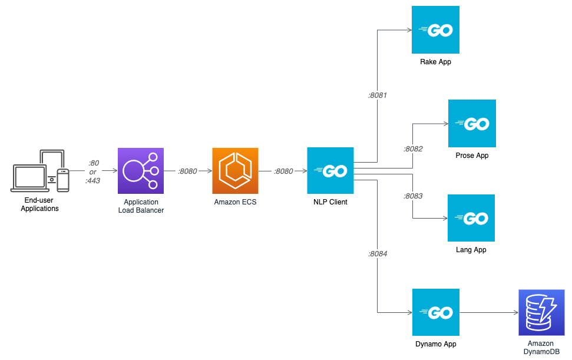

# Go Microservice: NLP Client

  


A Go-based microservice, part of a set of (5) microservices for the application used in the blog
post, [Cross-Account Amazon Elastic Container Registry (ECR) Access for ECS: Deploying containerized applications on Amazon ECS using cross-account elastic container registries](https://garystafford.medium.com/amazon-elastic-container-registry-ecr-cross-account-access-for-ecs-2f90fcb02c80). Please read the post for complete instructions on how to use the files in this repository.

1. [nlp-client](https://github.com/garystafford/nlp-client)
2. [dynamo-app](https://github.com/garystafford/dynamo-app)
3. [prose-app](https://github.com/garystafford/prose-app)
4. [lang-app](https://github.com/garystafford/lang-app)
5. [rake-app](https://github.com/garystafford/rake-app)

## Amazon ECS Architecture

Diagram of services deployed to Amazon ECS.



## Kubernetes Architecture

### Argo CD Deployment Graph

View of services deployed to Amazon EKS via Argo CD.


### Kiali Graph

Application as seen in Amazon EKS with Istio service mesh. Kubernetes resource files included in project.


## Routes

The follow routes are available though the NLP Client.

```json
[
  {
    "method": "GET",
    "path": "/error",
    "name": "main.getError"
  },
  {
    "method": "POST",
    "path": "/keywords",
    "name": "main.getKeywords"
  },
  {
    "method": "POST",
    "path": "/language",
    "name": "main.getLanguage"
  },
  {
    "method": "GET",
    "path": "/health",
    "name": "main.getHealth"
  },
  {
    "method": "GET",
    "path": "/health/:app",
    "name": "main.getHealthUpstream"
  },
  {
    "method": "GET",
    "path": "/routes",
    "name": "main.getRoutes"
  },
  {
    "method": "POST",
    "path": "/tokens",
    "name": "main.getTokens"
  },
  {
    "method": "POST",
    "path": "/entities",
    "name": "main.getEntities"
  },
  {
    "method": "POST",
    "path": "/sentences",
    "name": "main.getSentences"
  },
  {
    "method": "POST",
    "path": "/record",
    "name": "main.putDynamo"
  }
]
```

## Run Services Locally

Create [DynamoDB CloudFormation stack](https://github.com/garystafford/dynamo-app/blob/master/dynamodb-table.yml) from
the `dynamodb-table.yml` CloudFormation template. Creates the `NLPText` table.

```bash
aws cloudformation create-stack \
    --stack-name dynamodb-table-stack \
    --template-body file://dynamodb-table.yml
```

Run each of the (5) service from a different terminal window.

```bash
export NLP_CLIENT_PORT=8080
export RAKE_PORT=8081
export PROSE_PORT=8082
export LANG_PORT=8083
export DYNAMO_PORT=8084
export RAKE_ENDPOINT=http://localhost:${RAKE_PORT}
export PROSE_ENDPOINT=http://localhost:${PROSE_PORT}
export LANG_ENDPOINT=http://localhost:${LANG_PORT}
export DYNAMO_ENDPOINT=http://localhost:${DYNAMO_PORT}
export API_KEY=SuP3r5eCRetAutHK3y

## Run service locally

go mod init github.com/garystafford/nlp-client

go test -v

go mod tidy -v
go run *.go
```

## Test the Local Service

From a new terminal window.

```shell
export API_KEY=SuP3r5eCRetAutHK3y
export TEXT="The Nobel Prize is regarded as the most prestigious award in the World. Notable winners have included Marie Curie, Theodore Roosevelt, Albert Einstein, George Bernard Shaw, and Winston Churchill."

curl -s -X GET \
    "http://localhost:8080/health" \
    -H "X-API-Key: ${API_KEY}" \
    -H "Content-Type: application/json"

curl -s -X GET \
    "http://localhost:8080/routes" \
    -H "X-API-Key: ${API_KEY}" \
    -H "Content-Type: application/json"

curl -s -X POST \
    "http://localhost:8080/keywords" \
    -H "X-API-Key: ${API_KEY}" \
    -H "Content-Type: application/json" \
    -d "{\"text\": \"${TEXT}\"}"
```

## Build Images for Amazon Elastic Container Registry (ECR)

```bash
# change me
export ISV_ACCOUNT=111222333444
export ISV_ECR_REGION=us-east-2
export CUSTOMER_ACCOUNT=999888777666
export CUSTOMER_ECR_REGION=us-west-2

aws ecr get-login-password \
    --region ${ISV_ECR_REGION} \
| docker login \
    --username AWS \
    --password-stdin ${ISV_ACCOUNT}.dkr.ecr.${ISV_ECR_REGION}.amazonaws.com

docker build -t ${ISV_ACCOUNT}.dkr.ecr.${ISV_ECR_REGION}.amazonaws.com/rake-app:1.2.1 . --no-cache
docker push ${ISV_ACCOUNT}.dkr.ecr.${ISV_ECR_REGION}.amazonaws.com/rake-app:1.2.1

aws ecr get-login-password \
    --region ${CUSTOMER_ECR_REGION} \
| docker login \
    --username AWS \
    --password-stdin ${CUSTOMER_ACCOUNT}.dkr.ecr.${CUSTOMER_ECR_REGION}.amazonaws.com

docker build -t ${CUSTOMER_ACCOUNT}.dkr.ecr.${CUSTOMER_ECR_REGION}.amazonaws.com/nlp-client:1.2.1 . --no-cache
docker push ${CUSTOMER_ACCOUNT}.dkr.ecr.${CUSTOMER_ECR_REGION}.amazonaws.com/nlp-client:1.2.1

docker build -t ${CUSTOMER_ACCOUNT}.dkr.ecr.${CUSTOMER_ECR_REGION}.amazonaws.com/prose-app:1.2.1 . --no-cache
docker push ${CUSTOMER_ACCOUNT}.dkr.ecr.${CUSTOMER_ECR_REGION}.amazonaws.com/prose-app:1.2.1

docker build -t ${CUSTOMER_ACCOUNT}.dkr.ecr.${CUSTOMER_ECR_REGION}.amazonaws.com/lang-app:1.2.1 . --no-cache
docker push ${CUSTOMER_ACCOUNT}.dkr.ecr.${CUSTOMER_ECR_REGION}.amazonaws.com/lang-app:1.2.1

docker build -t ${CUSTOMER_ACCOUNT}.dkr.ecr.${CUSTOMER_ECR_REGION}.amazonaws.com/dynamo-app:1.2.1 . --no-cache
docker push ${CUSTOMER_ACCOUNT}.dkr.ecr.${CUSTOMER_ECR_REGION}.amazonaws.com/dynamo-app:1.2.1

# display images
docker image ls --filter=reference='*amazonaws.com/*'
```

## Deploy Docker Stack

Running (5) service Stack locally, from Docker Swarm.

```bash
# change me
export ISV_ACCOUNT=111222333444
export ISV_ECR_REGION=us-east-2
export CUSTOMER_ACCOUNT=999888777666
export CUSTOMER_ECR_REGION=us-west-2

# don't change me
export NLP_CLIENT_PORT=8080
export RAKE_PORT=8080
export PROSE_PORT=8080
export LANG_PORT=8080
export DYNAMO_PORT=8080
export RAKE_ENDPOINT=http://rake-app:${RAKE_PORT}
export PROSE_ENDPOINT=http://prose-app:${PROSE_PORT}
export LANG_ENDPOINT=http://lang-app:${LANG_PORT}
export DYNAMO_ENDPOINT=http://dynamo-app:${DYNAMO_PORT}
export API_KEY=SuP3r5eCRetAutHK3y
export TEXT="The Nobel Prize is regarded as the most prestigious award in the World. Notable winners have included Marie Curie, Theodore Roosevelt, Albert Einstein, George Bernard Shaw, and Winston Churchill."

docker stack deploy --compose-file docker/stack.yml nlp

# display containers
docker stack ps nlp --no-trunc
docker container ls

# delete stack
docker stack rm nlp
```

Sample output from Docker Swarm stack deployment.

```text
> docker container ls
CONTAINER ID   IMAGE                           COMMAND         CREATED          STATUS          PORTS                    NAMES
3534e9ea38dd   garystafford/prose-app:1.2.1    "/go/bin/app"   18 minutes ago   Up 18 minutes                            nlp_prose-app.1.rsehzmd5j3eylt6a6h76lwdwx
6f9affbbc369   garystafford/rake-app:1.2.1     "/go/bin/app"   18 minutes ago   Up 18 minutes                            nlp_rake-app.1.fwggsue67gc0f0mri5av7z1y6
215237a35523   garystafford/lang-app:1.2.1     "/go/bin/app"   18 minutes ago   Up 18 minutes                            nlp_lang-app.1.a0mjdhp8f8lqjdx8wse36b6d3
80cbf710d398   garystafford/nlp-client:1.2.1   "/go/bin/app"   18 minutes ago   Up 18 minutes   0.0.0.0:8080->8080/tcp   nlp_nlp-client.1.itupgd2tsuua0427yqv7cdhjk
0ccce2965bfd   garystafford/dynamo-app:1.2.1   "/go/bin/app"   18 minutes ago   Up 18 minutes                            nlp_dynamo-app.1.mb2pwkdtb3yn64al50bskgtwh
```
